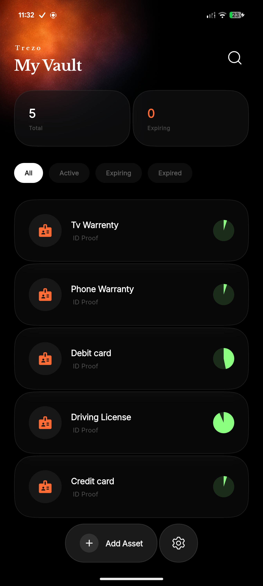
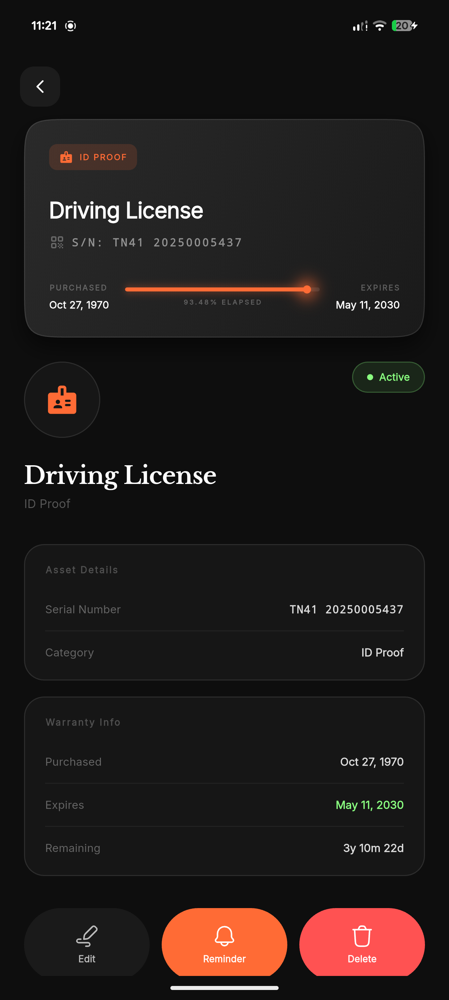
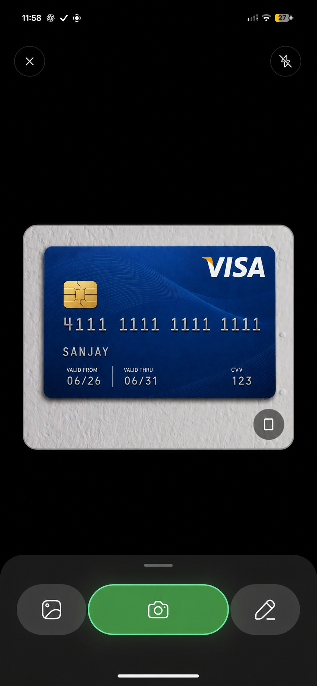

<div align="center">
  


  **Your premium, offline-first personal asset & warranty tracker.**

  <p>
    
    
    
  </p>

  <p>
    <a href="#sparkles-features">Features</a> •
    <a href="#camera-screenshots">Screenshots</a> •
    <a href="#wrench-tech-stack">Tech Stack</a> •
    <a href="#rocket-getting-started">Getting Started</a> •
    <a href="#shield-privacy--security">Privacy</a>
  </p>
</div>

---

Trezo is a state-of-the-art mobile application built with Flutter that completely rethinks how you track personal assets, warranties, and receipts. Designed with a sleek, high-end dark aesthetic (`#161616` surfaces with `#FF6B35` neon orange accents), Trezo delivers a "wow" experience through fluid animations, squircle corners, and an uncompromising focus on user privacy.

## :sparkles: Features

*   :lock: **Offline-First Vault:** Your assets are stored exclusively on your device using an encrypted local Isar database. Only your name and email touch the cloud.
*   :mag_right: **Smart OCR Receipt Scanning:** Instantly extract brands, prices, and dates from receipts and invoices using on-device Machine Learning (Google ML Kit).
*   :chart_with_upwards_trend: **Dynamic Visual Analytics:** Real-time circular progress rings track exactly how many days of warranty you have left.
*   :bell: **Intelligent Reminders:** Get local push notifications 1 month, 1 week, and 1 day before an asset's warranty expires, or set completely custom dates.
*   :art: **Premium UI/UX:** Built with `figma_squircle` for incredibly smooth iOS-style continuous curves, fluid `TweenAnimationBuilder` entry animations, and the elegant `Libre Baskerville` typeface.
*   :key: **Biometric App Lock:** Secure your entire inventory behind Face ID or fingerprint authentication.

## :camera: Screenshots

<div align="center">
  <table style="border-collapse: collapse; border: none;">
    <tr>
      <td align="center"><b>Home Dashboard</b></td>
      <td align="center"><b>Asset Details</b></td>
      <td align="center"><b>Smart Scanner</b></td>
    </tr>
    <tr>
      <td>
        
      </td>
      <td>
        
      </td>
      <td>
        
      </td>
    </tr>
  </table>
  <p><i>(Place your actual screenshots into the <code>assets/screenshots/</code> folder to display them here!)</i></p>
</div>

## :wrench: Tech Stack

Trezo leverages modern packages to ensure maximum performance and beautiful design:

| Layer | Technologies Used |
| :--- | :--- |
| **Framework** | Flutter, Dart |
| **Local Storage** | Isar Database (`isar`, `isar_flutter_libs`) |
| **Authentication** | Firebase Auth, Google Sign-In |
| **Machine Learning** | `google_mlkit_text_recognition`, `google_mlkit_entity_extraction` |
| **UI & Animations** | `figma_squircle`, `auto_animated`, `google_fonts`, `hugeicons` |
| **Device Integrations** | `flutter_local_notifications`, `local_auth`, `camera`, `image_picker` |

## :rocket: Getting Started

Follow these instructions to build and run Trezo locally on your machine.

### Prerequisites
*   [Flutter SDK](https://flutter.dev/docs/get-started/install) (Version 3.11.5 or higher)
*   Android Studio / Xcode
*   A physical device or emulator

### Installation

1.  **Clone the repository**
    ```bash
    git clone https://github.com/yourusername/trezo.git
    cd trezo
    ```

2.  **Install dependencies**
    ```bash
    flutter pub get
    ```

3.  **Generate Isar Database Files**
    ```bash
    flutter pub run build_runner build --delete-conflicting-outputs
    ```

4.  **Run the App**
    ```bash
    flutter run
    ```

## :shield: Privacy & Security

Trezo was engineered from the ground up to respect user privacy:
*   **Zero Cloud Asset Tracking:** We **do not** upload, sync, or store your assets, photos, or notes to any cloud servers. 
*   **Authentication Only:** Firebase is used strictly for secure authentication (Email/Google).
*   **On-Device Processing:** All OCR scanning happens locally on your phone's processor. No images are ever sent to external APIs for processing.

---

<div align="center">
  <b>Designed and Engineered with ❤️</b><br>
  <a href="docs/index.html">View Privacy Policy</a> | <a href="docs/terms.html">View Terms & Conditions</a>
</div>
